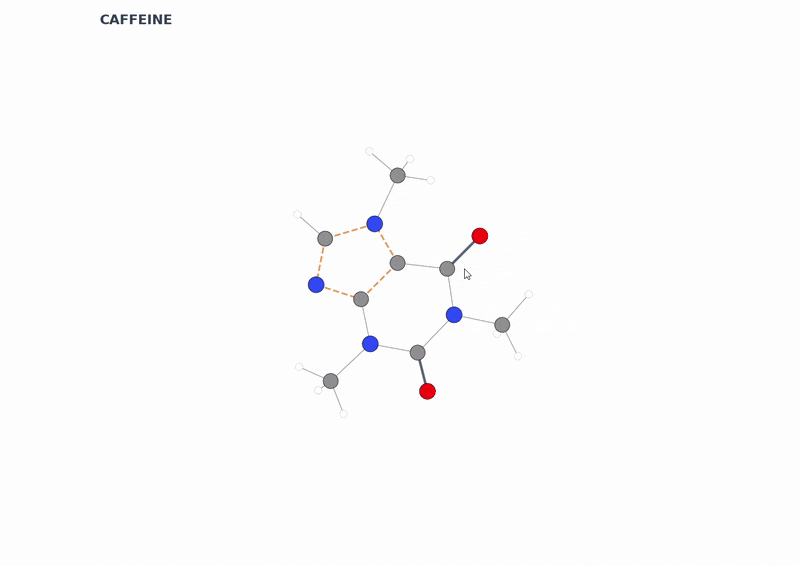

# 🧬 Scientific Molecular Visualizer
> **Real-time 3D molecular analysis tool built with RDKit, PubChemPy, Matplotlib, and CustomTkinter**

  

**Scientific Molecular Visualizer** is a modern, scientific desktop application that allows users to search by molecule name via PubChem, generate 3D coordinates, examine molecules by rotating them, obtain information by selecting atoms and bond types, and export data as PDB/XYZ.
This project offers an interactive molecular visualization experience for chemists, students, science enthusiasts, and developers.
---
##  Features
### 1. PubChem Integration
→ Smart Search:** Type in a molecule name → Data is automatically retrieved from PubChem.
→ Structure Generation:** Creates 3D structures via SMILES using RDKit.
### 2. Full 3D Interaction
→ Navigate: Rotate and zoom in a Matplotlib 3D environment.
→ Atom Info: Click on an atom to view element information (Element, Atomic No, Hybridization).
→ Bond Analysis: Click on a bond to view Single / Double / Triple / Aromatic bond types.
→ Interaction Detection: Automatic detection of metallic / ionic interactions based on distance.
### 3. True CPK Color System
→ The full list of international CPK color standards is implemented for accurate scientific visualization.
### 4. PDB / XYZ Export
→ One-click Export:** Save your models as `molecule.pdb` or `molecule.xyz` via RDKit.
### 5. Modern Interface
→ UI: CustomTkinter Light Mode with a responsive sidebar and live property display.
---
## 🛠 Installation

### 1. Clone the repository

git clone [https://github.com//.git](https://github.com/cagatay005/Scientific-Molecular-Visualizer.git)
cd molecular-visualizer

2. Install Requirements
pip install -r requirements.txt
Main Dependencies: rdkit, pubchempy, numpy, matplotlib, customtkinter
Note for RDKit: If you encounter issues installing RDKit via pip, using Conda is recommended:
Bash
conda install -c conda-forge rdkit
3. Run the Application
python molecular_visualizer.py
The program will automatically start by loading the Caffeine molecule.
• Project Structure
MolecularVisualizer
├── data.py                 # CPK color standard and atom styles
├── molecular_visualizer.py # Main application
├── demo.gif             # Demonstration GIF
└── README.md               # Documentation
• Technical Details
🔹 3D Coordinate Generation (RDKit)
The app uses a robust pipeline to generate accurate 3D models:
AddHs(): Adds explicit hydrogens.
EmbedMolecule(): Generates initial 3D coordinates.
MMFFOptimizeMolecule(): Optimizes geometry using the MMFF force field.
🔹 Bond Classification System
Bonds are automatically detected and styled:
Bond Type,Style,Color,Hex Code
Single,Solid,Grey,#7F8C8D
Double,Solid,Dark Blue,#2C3E50
Triple,Solid,Black,#1A2530
Aromatic,Dashed,Orange,#E67E22
🔹 Selectable Atoms & Bonds
Implemented using mpl_toolkits.mplot3d objects:
Path3DCollection (atoms)
Line3DCollection (bonds)
Both configured with picker=True to allow mouse interaction.
Controls:
Input Action,Gesture,Function
Left Mouse Button,Hold & Drag,Rotate (Orbit view around the molecule)
Middle Mouse Button,Hold & Drag,Pan (Translate view / Move camera)
Right Mouse Button,Hold & Drag,Zoom (Smooth zoom in/out)

• License
This project is released under the MIT License.
